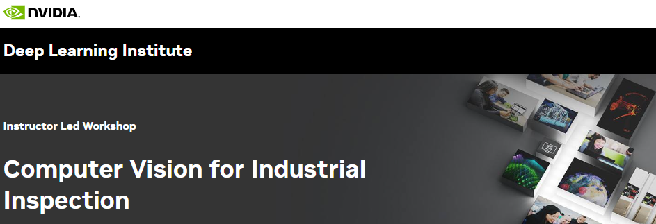

## Table of Contents
1. [Description](#description)
2. [Information](#information)
3. [Certificate](#certificate)

## Description

Whether companies are manufacturing semiconductor chips, airplanes, automobiles, smartphones, or food or beverages, quality and throughput are key benefits of optimization. Poor quality and throughput can result in significant operational, financial, and reputational costs. Deep learning-based computer vision technology enables manufacturers to perform automated visual inspection. Compared to traditional visual inspection processes—which are often manual and rules-based—visual inspection AI can improve efficiency, reduce operating costs, and deliver more consistent results.

In this Deep Learning Institute (DLI) workshop, developers will learn how to create an end-to-end hardware-accelerated industrial inspection pipeline to automate defect detection. Using NVIDIA’s own real production data set as an example, we’ll illustrate how the application can be easily applied to a variety of manufacturing use cases. Developers will also learn to identify and mitigate common pitfalls in deep learning-based computer vision tasks, and be able to deploy and measure the effectiveness of their AI solution.

## Information
At the conclusion of the workshop, you’ll have an understanding of the fundamental tools and techniques for GPU-accelerated Python applications with CUDA and Numba:

> - Extract meaningful insights from the provided data set using Pandas DataFrame.
> - Apply transfer-learning to a deep learning classification model.
> - Fine-tune the deep learning model and set up evaluation metrics.
> - Deploy and measure model performance.
> - Experiment with various inference configurations to optimize model performance.

More detailed information and links for the course can be found on the [course website](https://www.nvidia.com/en-eu/training/instructor-led-workshops/computer-vision-for-industrial-inspection/).

## Certificate

The certificate for the course can be found below:

- ["Computer Vision for Industrial Inspection" - NVIDIA Deep Learning Institute]() (Issued On: December 2024)
